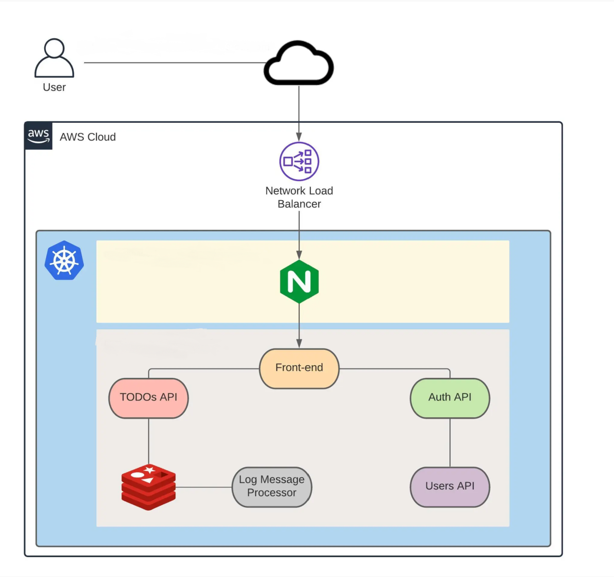

# KubeToDo
A To-do application deployed on Elastic Kubernetes Service (EKS).  

The architecture of this application is designed to mimic a real world web application development, such that each microservice is deployed in a container as a pod within a Kubernetes Cluster and each microservice is written a different framework.
The microservice distribution is as follows:

* Frontend: [VueJs](https://vuejs.org/)
* Todos API: [NodeJs](https://nodejs.org/)
* Auth API: [GoLang](https://golang.org/)
* Database: [Redis](https://redis.io/) 
* Queue: [Python3](https://www.python.org/)
* Users API: [SrpingBoot](https://spring.io/)
* Network Operator: [Calico](https://www.projectcalico.org/)
* Ingress Controller: [Kubernetes-NGINX](https://www.nginx.com/)

## Flowchart:

 

## Deployment
Each container is stored in Elastic Container Registry (ECR) and EKS pulls the container images from the ECR and deploys them as pods in k8s. The entire deployment strategy is constructed and deployed behind AWS' CDN infrastructure, and all the incoming requests are handled by the AWS' network Load Balancer. Also, NGINX ingress controller is configured as a deployment controller to route the incoming traffic data within the Kubernetes Pods.
## Security
All microservices are governed by Network policies and RBAC to enforce security and access control within the application. For example, the frontend pod is accessible to all incoming requests, but front end pod can only communicate with Auth API and Todos API. Also Users API can only communicate to the Auth API, and Todos API can only communicate to the redis server.  
This is enforced by keeping in mind the security design principle of Least Privilege.  
The application uses JWT tokens for managing authentication and authorization. These tokens are stored within the databsae for authenticated users. Each pod has it's own documentation for the working and debugging refer to the folder documentation for each pod.